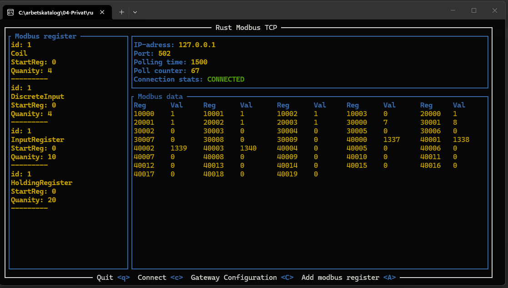

# Application Modbus TCP client written in rust.

## Features
- Modbus TCP client
- Read Coils
- Read Discrete Inputs
- Read Holding Registers
- Read Input Registers
- TUI interface
- Configurable polling

## Known Limitations
- Error handling when invalid response from server
- Unable to write to data to modbus registers
- Unable to convert response data from server UINT/INT etc.

## Project Background 
This is my absolute first application written in rust, my focus with this project was to learn the basics in rust. The plan was to spend 30-60 minutes every day to get something working, get the first release. Hopefully when i come back to this project i will laugh at how bad this application is.   
Working today as Automation Engineer programmering PLCs according to the international standard IEC 61131-3.
